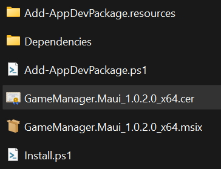
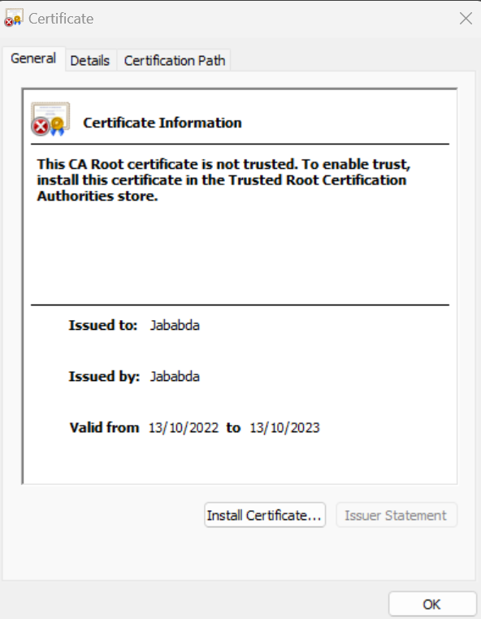
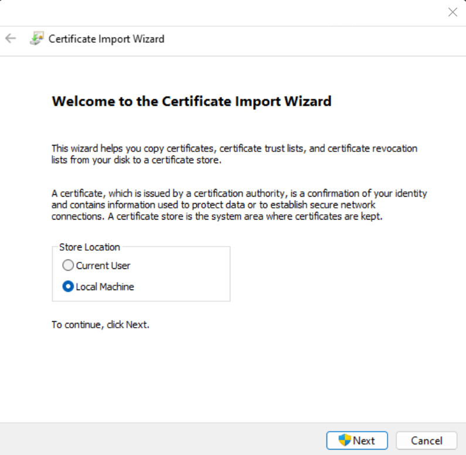
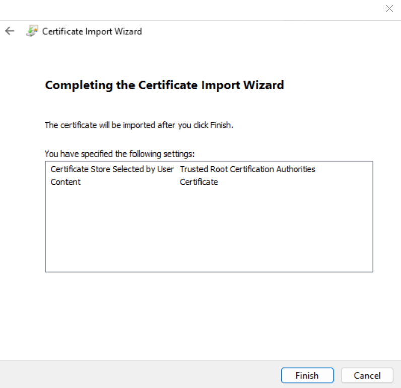

# Install
1. Double click the .cer file

    
    
2. Click "Install Certificate"

    
    
3. Select Local Machine and click Next

    

4. Select "Place all certifcates in the following store" browse to "Trusted Root Certification Authorities" and click next

    

5. Finish

    